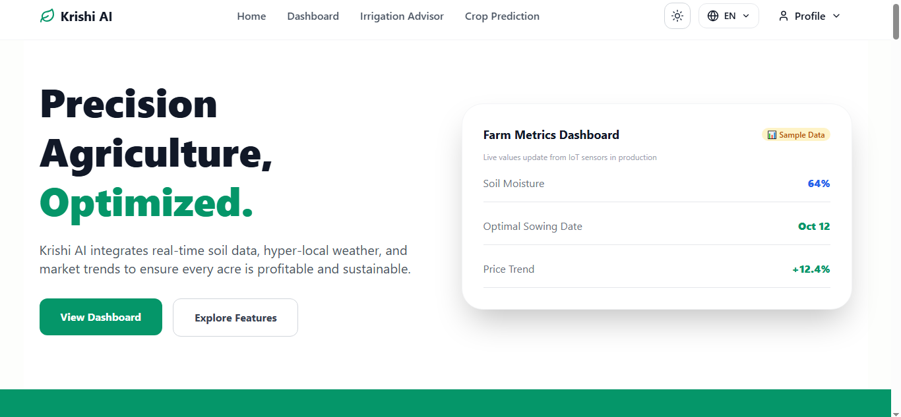
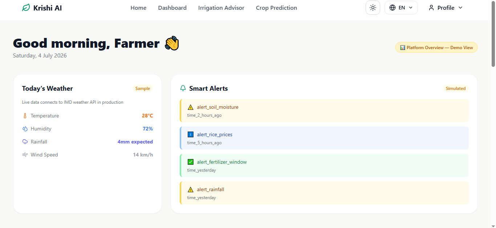
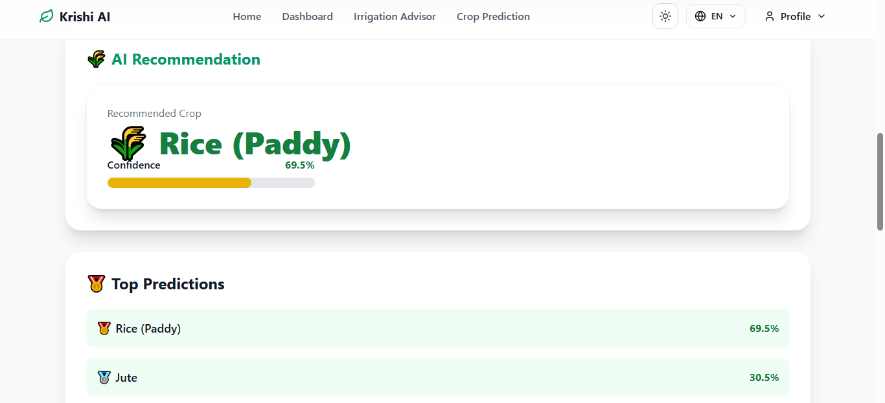
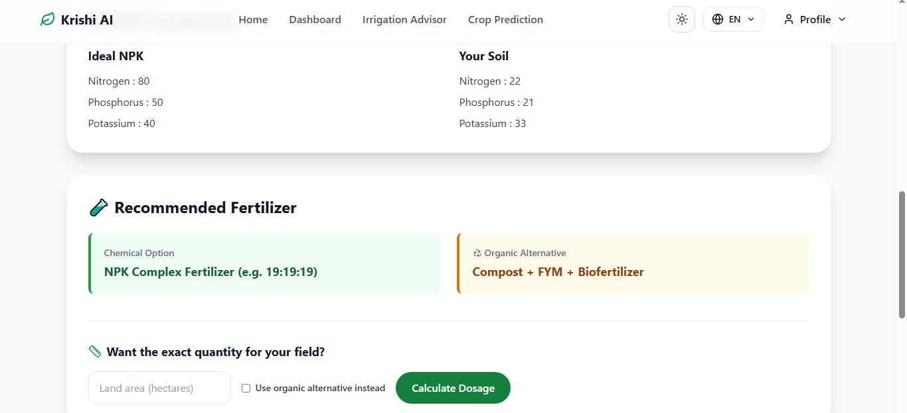
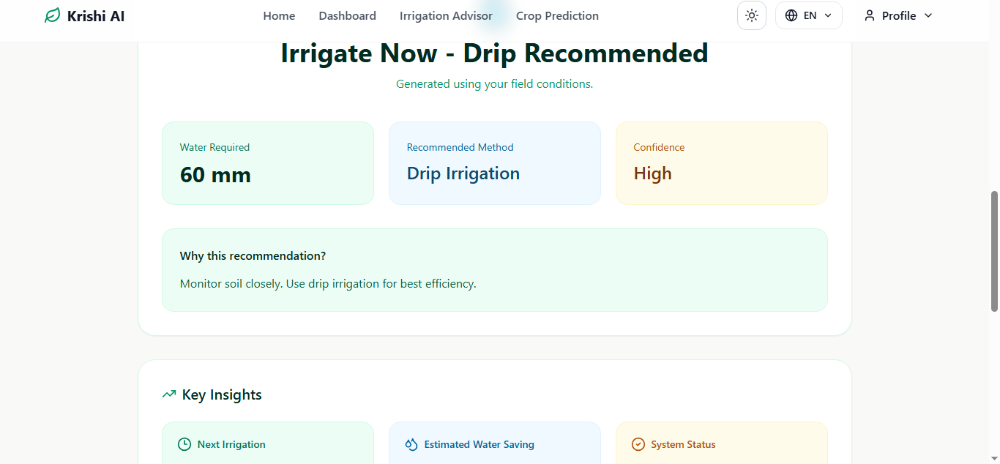
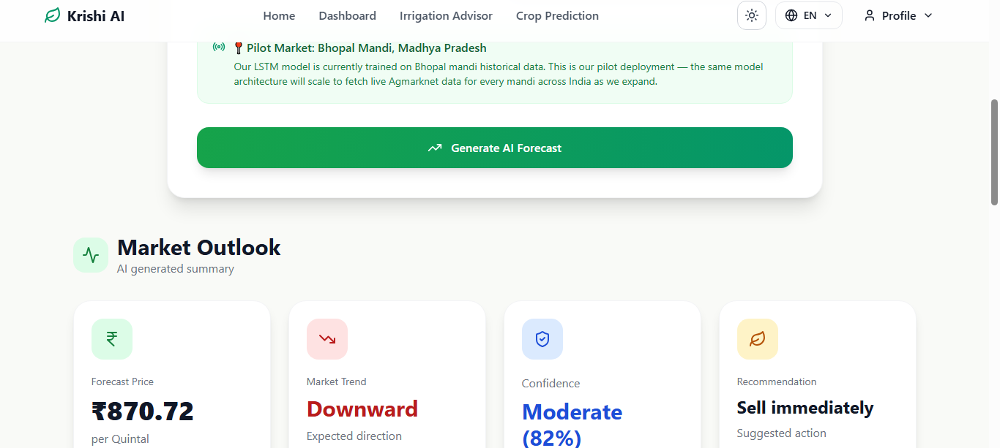

# 🌾 KrishiAI

### *Empowering Smart Agriculture with Artificial Intelligence*

<p align="center">
  
  
  
  
  
  
  
  
</p>

<p align="center">
  
</p>

<p align="center">
  <b>🌱 AI Powered • 🌍 Multilingual • 📈 Data Driven • 👨‍🌾 Farmer Friendly</b>
</p>

---

## 📖 Table of Contents
- [About the Project](#-about-the-project)
- [Problem Statement](#-problem-statement)
- [Our Solution](#-our-solution)
- [Key Features](#-key-features)
- [Technology Stack](#-technology-stack)
- [System Architecture](#-system-architecture)
- [Application Workflow](#-application-workflow)
- [Installation](#-installation)
- [Screenshots](#-screenshots)
- [Contributing](#-contributing)
- [License](#-license)

---

## 🌾 About the Project

**KrishiAI** (formerly AgriAI) is a comprehensive **AI-powered precision agriculture platform** designed specifically for Indian farmers. It integrates real-time soil data, hyper-local weather, market intelligence, and advanced machine learning models to help farmers make better decisions throughout the farming cycle.

The platform aims to bridge the gap between traditional farming practices and modern technology, making AI accessible, affordable, and useful for small and marginal farmers.

**Vision**: *Make every acre profitable and sustainable.*

---

## ❗ Problem Statement

Indian farmers face numerous challenges:
- Incorrect crop selection leading to low yield
- Overuse or underuse of fertilizers
- Inefficient irrigation causing water wastage
- Uncertainty in market prices
- Limited access to agricultural experts
- Language barriers in digital tools
- Lack of data-driven decision making

These issues result in lower productivity, higher costs, and reduced income.

---

## 💡 Our Solution

KrishiAI provides an integrated platform that offers intelligent recommendations using:
- Soil nutrient analysis (NPK, pH)
- Weather conditions
- Historical data
- Machine Learning models
- User farm profile

Farmers receive actionable insights in their preferred language (English, Hindi, Urdu, Tamil) through a simple and beautiful interface.

---

## ✨ Key Features

### 🌱 Crop Recommendation
- Predicts best crop based on soil NPK, temperature, humidity, pH, rainfall
- Shows confidence score and reasoning

### 🌿 Fertilizer Advisor
- Analyzes nutrient deficiencies
- Recommends chemical + organic fertilizers
- Provides exact dosage calculation

### 💧 Smart Irrigation Advisor
- Determines when and how much to irrigate
- Supports drip irrigation logic
- Considers evapotranspiration and weather

### 📈 Market Price Prediction
- LSTM model for price forecasting
- Helps decide best time to sell

### 🔐 Secure Authentication
- User registration with farm profile
- JWT-based authentication
- Protected dashboard

### 🌍 Multilingual Support
- English, Hindi, Urdu, Tamil
- Easy language switching

---

## 🛠 Technology Stack

### Frontend
- **React.js + Vite**
- **Tailwind CSS**
- **Framer Motion**
- **Lucide React** (icons)
- **i18next** (multilingual)

### Backend
- **Flask**
- **Flask-JWT-Extended**
- **Neon DB**
- **Flask-CORS**

### Machine Learning
- **Scikit-learn** (Random Forest)
- **Joblib** (model saving)
- **LSTM** (Price forecasting)
- **Pandas & NumPy**

---

## 🏗 System Architecture

```text
                     Farmer (Mobile / Desktop)
                               │
                               ▼
                    React Frontend (Vite + Tailwind)
                               │
                 REST API Calls (Axios)
                               │
                               ▼
                    Flask Backend Server
          ┌──────────────────────────────────────┐
          │  JWT Authentication                  │
          │  Crop Recommendation Engine          │
          │  Fertilizer Recommendation           │
          │  Irrigation Advisor                  │
          │  Price Forecasting (LSTM)            │
          │  User Management                     │
          └──────────────────────────────────────┘
                               │
                               ▼
                    Neon Database + ML Models

---

# 🔄 Application Workflow

```text
User Login / Register
        │
        ▼
Select AI Module
        │
        ▼
Enter Farm & Environmental Details
        │
        ▼
Flask Backend Processes Request
        │
        ▼
Machine Learning Model Predicts Result
        │
        ▼
Recommendation Displayed with Confidence Score
```

---

# 🚀 Installation & Setup

### 1️⃣ Clone the Repository

```bash
git clone https://github.com/<your-username>/KrishiAI.git
cd KrishiAI
```

---

## ⚙️ Backend Setup

```bash
cd Backend

pip install -r requirements.txt

python app.py
```

Backend will run at:

```
http://localhost:5000
```

---

## 💻 Frontend Setup

```bash
cd Frontend

npm install

npm run dev
```

Frontend will run at:

```
http://localhost:5173
```

---

# 📸 Screenshots


## 🏠 Dashboard

<p align="center">
  
</p>

---

## 🌾 Crop Recommendation

<p align="center">
  
</p>

---

## 🌿 Fertilizer Recommendation

<p align="center">
  
</p>

---

## 💧 Irrigation Prediction

<p align="center">
  
</p>

---

## 📈 Crop Price Forecast

<p align="center">
  
</p>

---

# 🤝 Contributing

Contributions are always welcome!

1. Fork this repository.
2. Create a new feature branch.

```bash
git checkout -b feature/your-feature
```

3. Commit your changes.

```bash
git commit -m "Add your feature"
```

4. Push to your branch.

```bash
git push origin feature/your-feature
```

5. Open a Pull Request.

---

<p align="center">

### 🌾 KrishiAI

**Empowering Farmers with Artificial Intelligence**

Made with ❤️ using **React**, **Flask**, **Machine Learning**, and **TensorFlow**

⭐ If you found this project helpful, consider giving it a **Star** on GitHub!

</p>
